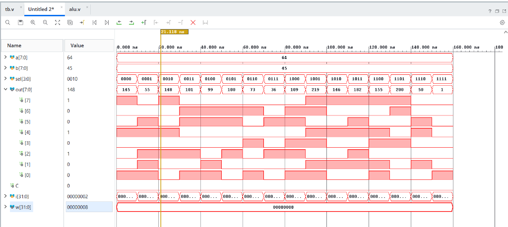

# 8-Bit Parametric Arithmetic Logic Unit (ALU)

## Overview

An **Arithmetic Logic Unit (ALU)** is a fundamental building block of a computer processor (CPU). This project implements a **Parametric 8-bit ALU** in Verilog capable of executing **16 distinct operations** across Arithmetic, Logic, Shift/Rotate, and Comparison categories.

---

## 📜 RTL Source Code (`alu.v`)

```verilog
`timescale 1ns / 1ps

module alu #(parameter w = 8) (
    input      [w-1:0] a,        // Operand A
    input      [w-1:0] b,        // Operand B
    input      [3:0]   sel,      // 4-bit opcode (16 operations)
    output reg [w-1:0] out,      // Result
    output reg         C         // Carry / Borrow flag
);
    // Internal w+1 wide register to capture carry 
    reg [w:0] temp;

    // Combinational logic 
    always @(*) begin
        // Default all outputs
        temp = {(w+1){1'b0}};
        out  = {w{1'b0}};
        C    = 1'b0;
        case (sel)
            // Arithmetic 
            4'b0000: begin  // ADD
                temp = {1'b0, a} + {1'b0, b};
                out  = temp[w-1:0];
                C    = temp[w];         // unsigned carry-out
            end
            4'b0001: begin  // SUB (A - B)
                temp = {1'b0, a} - {1'b0, b};
                out  = temp[w-1:0];
                C    = temp[w];         // borrow flag
            end
            4'b0010: begin  // MUL (lower w bits)
                out = a * b;
            end
            4'b0011: begin  // INC (A + 1)
                temp = {1'b0, a} + 1'b1;
                out  = temp[w-1:0];
                C    = temp[w];
            end
            4'b0100: begin  // DEC (A - 1)
                temp = {1'b0, a} - 1'b1;
                out  = temp[w-1:0];
                C    = temp[w];
            end
            4'b0101: begin  // ABS |A|
                out = a[w-1] ? (~a + 1'b1) : a;
            end
            // Logical 
            4'b0110: out = a ^ b;     // XOR
            4'b0111: out = a & b;     // AND
            4'b1000: out = a | b;     // OR
            4'b1001: out = ~(a & b);  // NAND
            4'b1010: out = ~(a | b);  // NOR
            4'b1011: out = ~(a ^ b);  // XNOR
            4'b1100: out = ~a;        // NOT A
            // Shift / Rotate 
            4'b1101: begin  // Rotate Left
                C   = a[w-1];
                out = {a[w-2:0], a[w-1]};
            end
            4'b1110: begin  // Arithmetic Right Shift
                C   = a[0];
                out = {a[w-1], a[w-1:1]};
            end
            // Compare 
            4'b1111: begin  // CMP
                if      (a > b) out = {{(w-1){1'b0}}, 1'b1};  //  1
                else if (a < b) out = {w{1'b1}};               // -1
                else            out = {w{1'b0}};               //  0
            end
            default: out = {w{1'b0}};
        endcase
    end
endmodule
```

---

## 🧪 Testbench Source Code (`tb.v`)

```verilog
`timescale 1ns / 1ps

module tb;                    
    parameter w = 8;
    reg  [w-1:0] a;
    reg  [w-1:0] b;
    reg  [3:0]   sel;
    wire [w-1:0] out;
    wire         C;

    alu #(.w(w)) DUT (
        .a   (a),
        .b   (b),
        .sel (sel),
        .out (out),
        .C   (C)
    );

    integer i;             
    initial begin
        a = 8'd100;           
        b = 8'd45;            
        for (i = 0; i <= 15; i = i + 1) begin   
            sel = i;
            #10;              
        end
        $finish;
    end
endmodule
```

---

## 📊 Operation Table

The ALU evaluates 16 operations based on the 4-bit opcode `sel[3:0]`:

| Opcode (`sel[3:0]`) | Operation | Category | Mathematical / Logical Expression |
| :---: | :--- | :--- | :--- |
| `0000` (0) | **ADD** | Arithmetic | `out = a + b`, sets Carry `C` |
| `0001` (1) | **SUB** | Arithmetic | `out = a - b`, sets Borrow `C` |
| `0010` (2) | **MUL** | Arithmetic | `out = a * b` (lower 8 bits) |
| `0011` (3) | **INC** | Arithmetic | `out = a + 1`, sets Carry `C` |
| `0100` (4) | **DEC** | Arithmetic | `out = a - 1`, sets Borrow `C` |
| `0101` (5) | **ABS** | Arithmetic | `out = \|a\|` (2's complement magnitude) |
| `0110` (6) | **XOR** | Logic | `out = a ^ b` |
| `0111` (7) | **AND** | Logic | `out = a & b` |
| `1000` (8) | **OR**  | Logic | `out = a \| b` |
| `1001` (9) | **NAND**| Logic | `out = ~(a & b)` |
| `1010` (10)| **NOR** | Logic | `out = ~(a \| b)` |
| `1011` (11)| **XNOR**| Logic | `out = ~(a ^ b)` |
| `1100` (12)| **NOT** | Logic | `out = ~a` |
| `1101` (13)| **ROTL**| Shift / Rotate | Rotate Left `a` by 1 bit |
| `1110` (14)| **ASHR**| Shift / Rotate | Arithmetic Right Shift `a` (preserves sign) |
| `1111` (15)| **CMP** | Comparison | If `a > b` → 1, If `a < b` → -1, Else → 0 |

---

## 🖼️ Simulation Output



The waveform confirms the 8-Bit ALU executing all operations across time, displaying operand inputs, control select line `sel[3:0]`, output result `out[7:0]`, and Carry flag `C`.

---

## 🛠️ How to Simulate

### Using Vivado
1. Open Vivado and open `ALU.xpr`
2. Run Behavioral Simulation
3. In the waveform window, set **Radix** to **Unsigned Decimal** and press **F** to Zoom Fit

### Using iverilog

    iverilog -o alu_sim ALU.srcs/sources_1/new/alu.v ALU.srcs/sim_1/new/tb.v
    vvp alu_sim

---

## 🧰 Tools Used

| Tool | Details |
|------|---------|
| Language | Verilog (IEEE 1364-2001) |
| Simulator | AMD Vivado Simulator (XSim) |
| Timescale | 1ns / 1ps |

---

## 👤 Author

- **Tool:** AMD Vivado 2026.1
